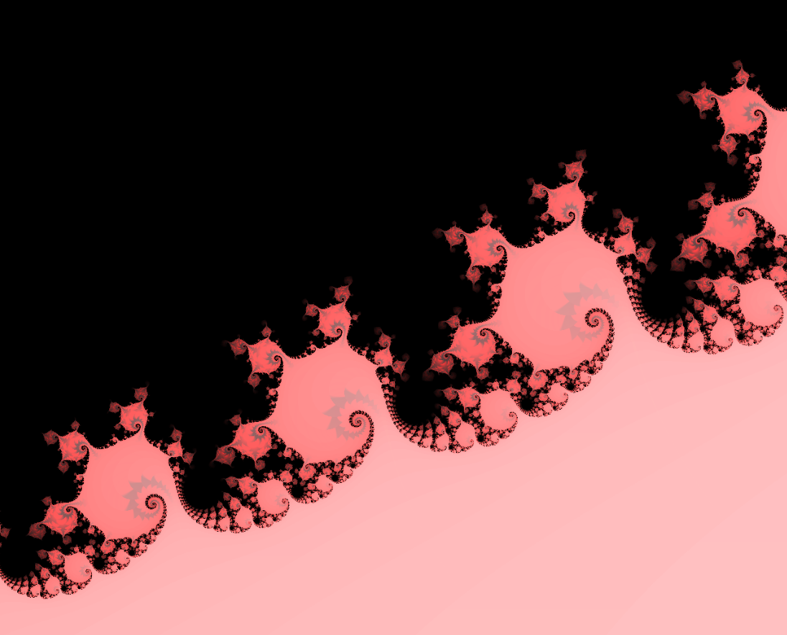
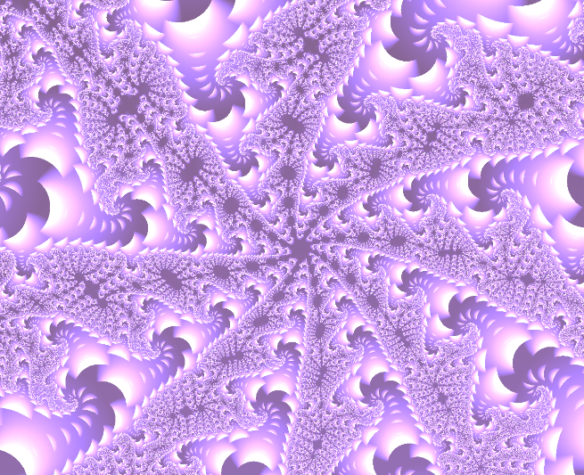
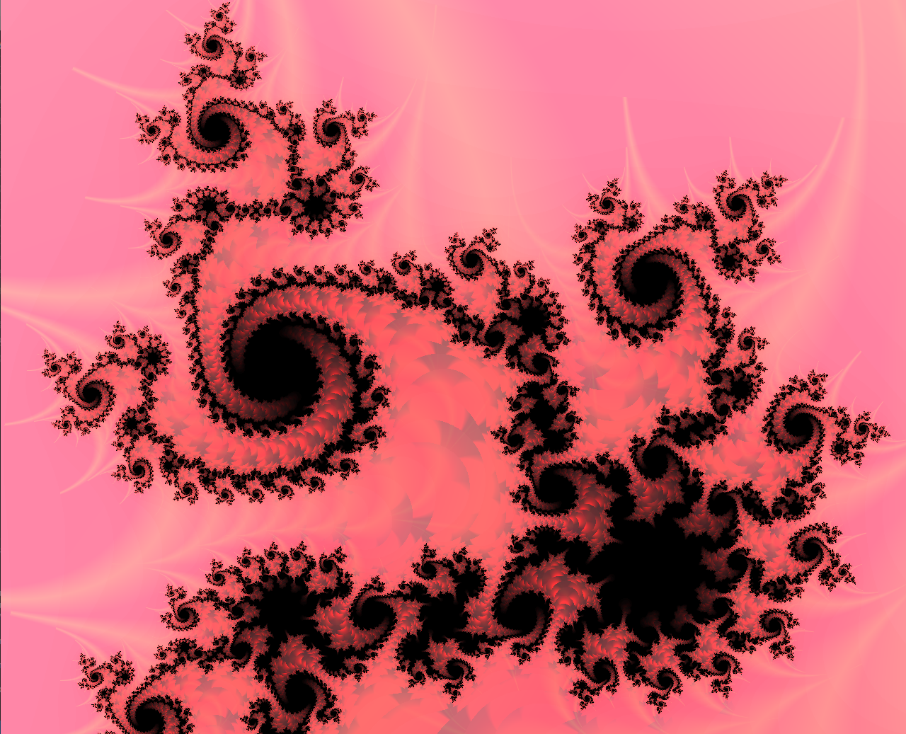

# Mandelbrot - A mandelbrot GPU-accelerated visualization 

<p align="center">

</p>

**Mandelbrot** consists of a real-time interactive application that I built in order to visualize the [mandelbrot set](https://en.wikipedia.org/wiki/Mandelbrot_set). This application is used in on of my [blog posts](https://arukiap.github.io/fractals/2019/06/02/rendering-the-mandelbrot-set-with-shaders.html) in order to introduce shader programming and fractals.

It is built using C++, OpenGL and GLSL with [this setup](https://github.com/Arukiap/OpenGL-PixelShader-Base) for pixel shader development. Please refer to the previous link for information on how to build and run the application.

## Experimenting with colors

If you want to experiment coloring the mandelbrot set by yourself through the use of the [orbit trap technique](https://en.wikipedia.org/wiki/Orbit_trap), go to the `/shaders/mandelbrot.fs` fragment shader code and play around with the following line of code (line 60):

```glsl
gl_FragColor = vec4(shade);
```

You can pass in different parameters to the color of each pixel, such as inverting the color scheme:

```glsl
gl_FragColor = vec4(1-shade);
```

or using the vector that stores orbit trapped values for the interesting colors you see below!

```glsl
//This is just an example, play around with the gl_FragColor computation!
gl_FragColor = vec4(orbitTrapMax.x,shade,orbitTrapMax.y,1.0);
```

<p align="center">



</p>


